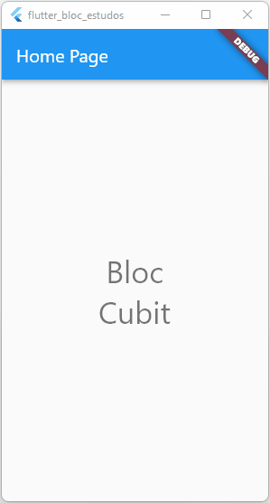

<h1 align="center">ESTUDANDO O BLOC</h1>

 BLOC.

### » SOBRE O APLICATIVO:

- Aplicando os conceitos de gerenciamento de estado com o BLOC.
- .

      <input type="checkbox" checked>
      <label>Contador com incremento e decremento númerico</label>
    

### Autor

